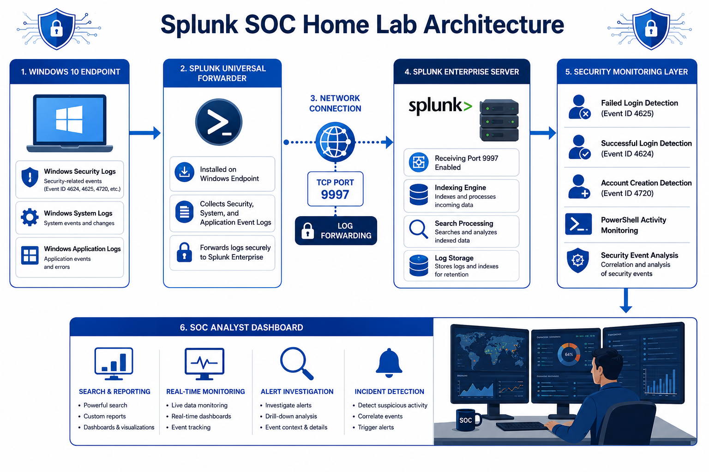
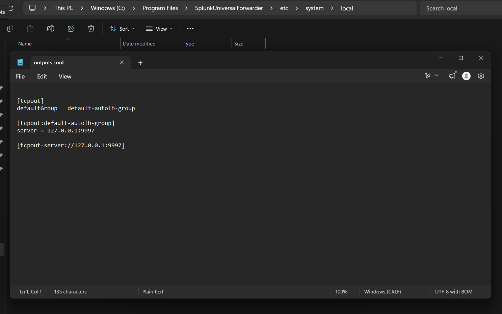
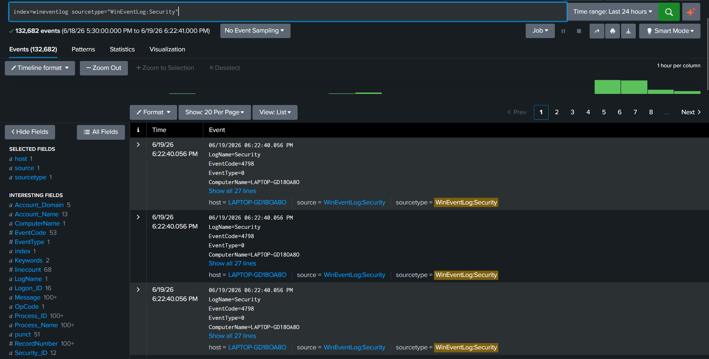
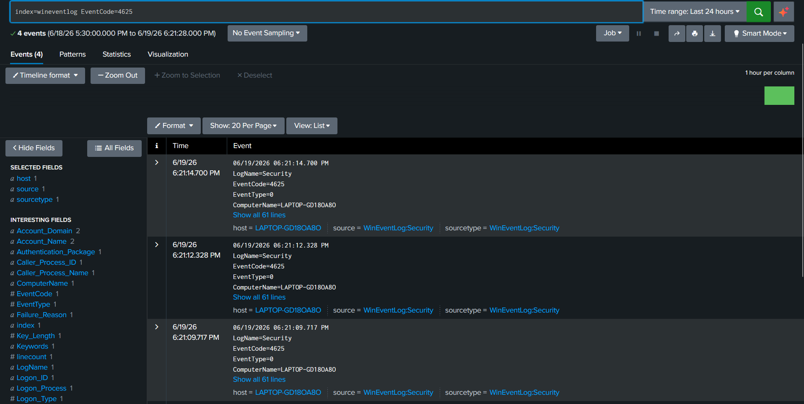
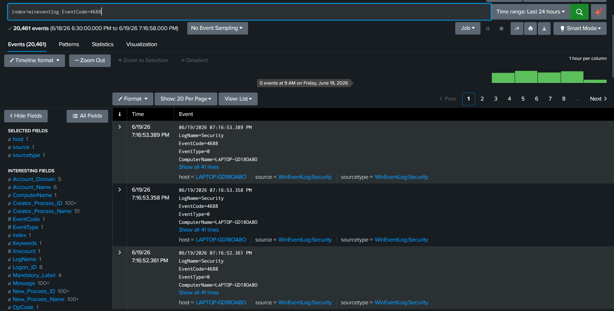
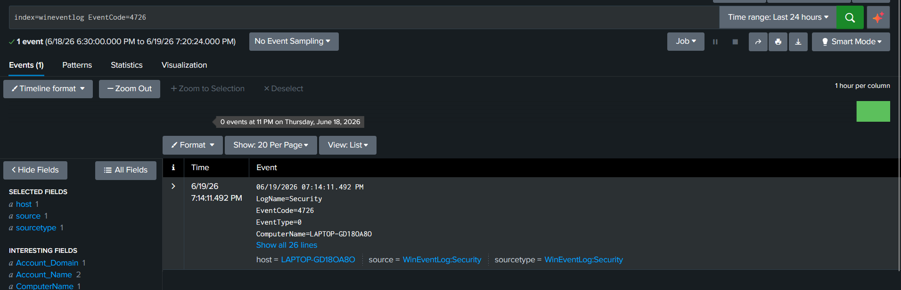

# Splunk SOC Home Lab

## Project Overview

This project demonstrates a Security Operations Center (SOC) home lab using Splunk Enterprise and Splunk Universal Forwarder.

The goal was to collect Windows Event Logs and send them to Splunk for monitoring and analysis.

## Technologies Used

- Splunk Enterprise
- Splunk Universal Forwarder
- Windows Event Logs
- Windows 11

---

## Architecture

Windows Endpoint ---> Splunk Universal Forwarder ---> Port 9997 ---> Splunk Enterprise ---> Search and Monitoring

### Architecture Diagram



---

## Configuration

The following configuration files were used to enable Windows Event Log collection and forwarding to Splunk Enterprise.

### inputs.conf

Location:

```text
configuration/inputs.txt
```

Purpose:

- Collect Windows Security Logs
- Collect Windows System Logs
- Collect Windows Application Logs
- Forward collected events to Splunk Enterprise

### outputs.conf

Purpose:

- Configure the Universal Forwarder to send logs to the Splunk receiving port (9997)
- Establish communication between the endpoint and Splunk Enterprise

### Configuration Screenshot




---

## Installation Steps

### Step 1: Install Splunk Enterprise

1. Download Splunk Enterprise
2. Run installer
3. Create admin account
4. Access Splunk at:

http://localhost:8000 or http://127.0.0.1:8000

### Step 2: Install Universal Forwarder

1. Download Universal Forwarder
2. Install on Windows machine

### Step 3: Enable Receiving Port on Splunk

Settings → Forwarding and Receiving

Add receiving port:

9997

### Step 4: Add Forward Server

Command:

```cmd
splunk add forward-server <Splunk_Server_IP>:9997
```

Example:

```cmd
splunk add forward-server 127.0.0.1:9997
```

### Step 5: Configure inputs.conf

1. Open Notepad as Administrator.
2. Configure like below:

```ini
[WinEventLog://Security]
disabled = 0
index = wineventlog
sourcetype = WinEventLog:Security

[WinEventLog://System]
disabled = 0
index = wineventlog
sourcetype = WinEventLog:System

[WinEventLog://Application]
disabled = 0
index = wineventlog
sourcetype = WinEventLog:Application
```

3. Save the file as `inputs.conf` in:

```text
C:\Program Files\SplunkUniversalForwarder\etc\system\local\
```

4. Select **Save as type: All Files (*.*)** and save.

### Step 6: Create a New Index

Before receiving Windows Event Logs, create a dedicated index in Splunk.

Navigate to:

Splunk → Settings → Indexes → New Index

Index Name:

```text
wineventlog (Same name as in the inputs.conf file)
```

Save the configuration.

This index is used to store Windows Event Logs forwarded from the Universal Forwarder.

### Step 7: Restart Forwarder

```cmd
splunk restart
```

### Step 8: Verify Logs

Search:

```spl
index=wineventlog sourcetype="WinEventLog:Security"
```

Expected Events:

- Event ID 4624
- Event ID 4625
- Event ID 4688
- Event ID 4720

---

## Screenshots

### Splunk Home


### Windows Security Logs


### Failed Login Detection


### Successful Login Detection


### New Process Created


### User Account Created


### User Account Deleted


### SOC Dashboard


### Alert Configuration


### Triggered Alert


### SPL Queries


---

## Detection Use Cases

### Failed Login Detection

SPL Query:

```spl
index=wineventlog EventCode=4625
```

Purpose:

Detect failed Windows login attempts that may indicate brute-force activity or unauthorized access attempts.

### Successful Login Detection

SPL Query:

```spl
index=wineventlog EventCode=4624
```

Purpose:

Monitor successful user authentication activity and verify legitimate access.

### Process Creation Monitoring

SPL Query:

```spl
index=wineventlog EventCode=4688
```

Purpose:

Monitor newly created processes and identify potentially suspicious execution activity.

### User Account Creation Detection

SPL Query:

```spl
index=wineventlog EventCode=4720
```

Purpose:

Detect the creation of new local user accounts.

### User Account Deletion Detection

SPL Query:

```spl
index=wineventlog EventCode=4726
```

Purpose:

Detect the deletion of local user accounts.

---

## Dashboard and Alerting

A custom SOC monitoring dashboard was created in Splunk to provide centralized visibility into Windows security events and endpoint activity.

Dashboard panels include:

- Failed Login Attempts
- Successful Login Activity
- Windows Security Events
- Event Volume Monitoring
- User Account Activity

Alerts were configured to notify on:

- Multiple Failed Login Attempts
- Suspicious User Activity
- Security Event Monitoring

---

## Skills Demonstrated

- Security Information and Event Management (SIEM)
- Splunk Enterprise Administration
- Splunk Universal Forwarder Configuration
- Windows Event Log Collection
- Log Analysis and Investigation
- Security Monitoring
- Dashboard Creation
- Alert Configuration
- SPL (Search Processing Language)
- Threat Detection Fundamentals
- Incident Detection and Analysis
- Windows Security Event Monitoring

---

## Conclusion

This project demonstrates the successful implementation of a Security Operations Center (SOC) home lab using Splunk Enterprise and Splunk Universal Forwarder.

The environment collects Windows Event Logs, forwards them to Splunk, and enables centralized monitoring, event analysis, dashboard creation, and alerting capabilities.

Through this project, practical experience was gained in SIEM deployment, log management, security monitoring, detection engineering, and incident investigation workflows commonly used by SOC Analysts and Security Operations teams.
